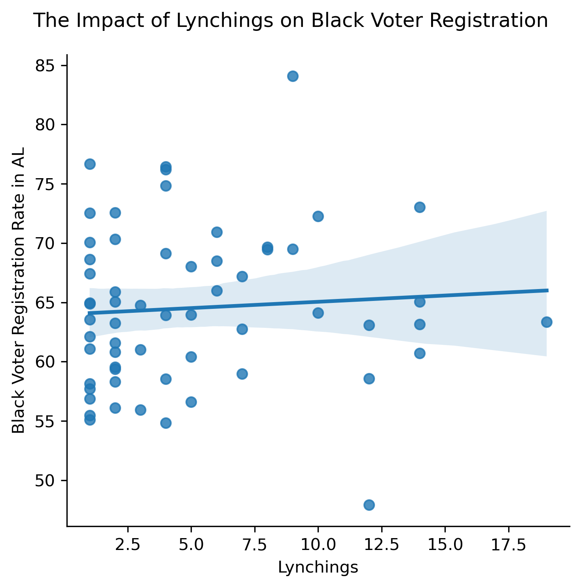
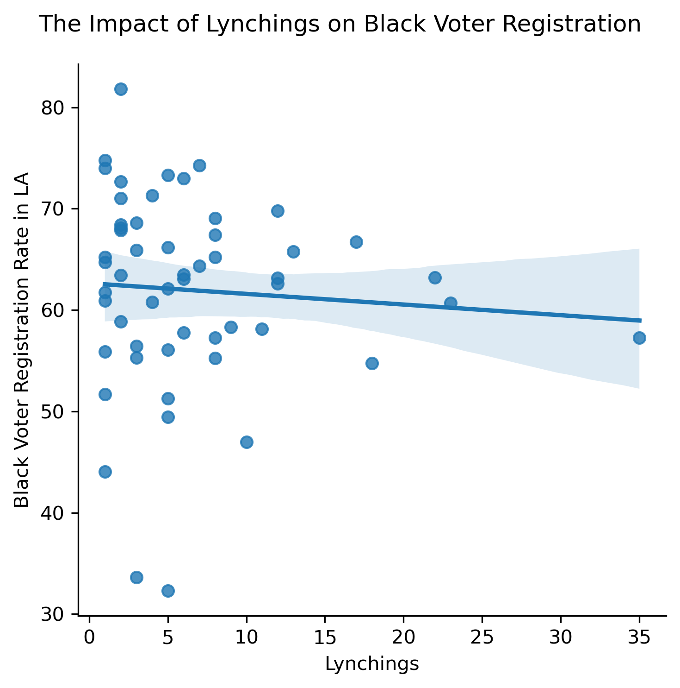
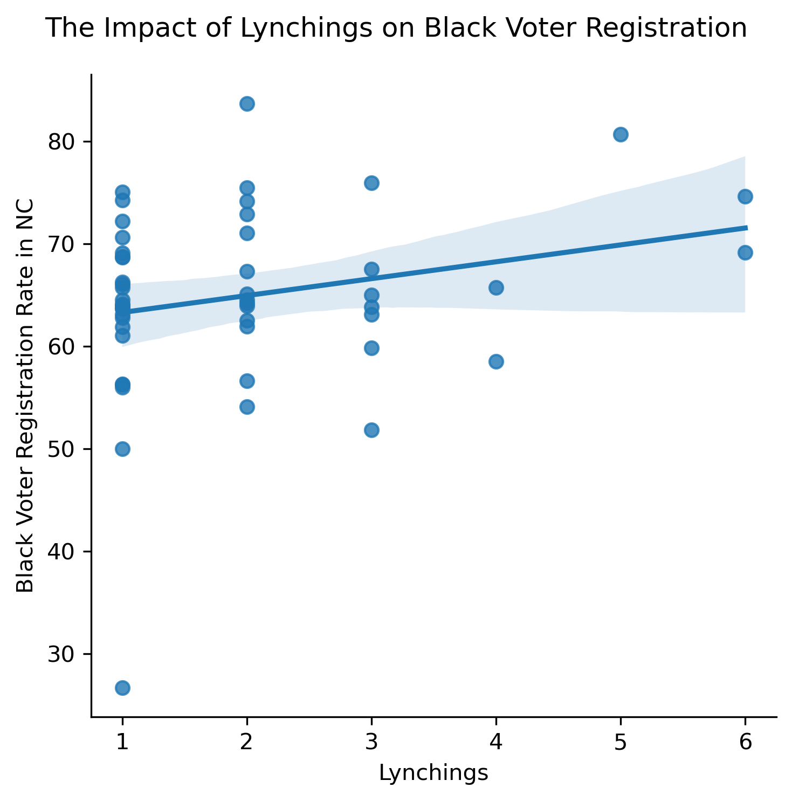
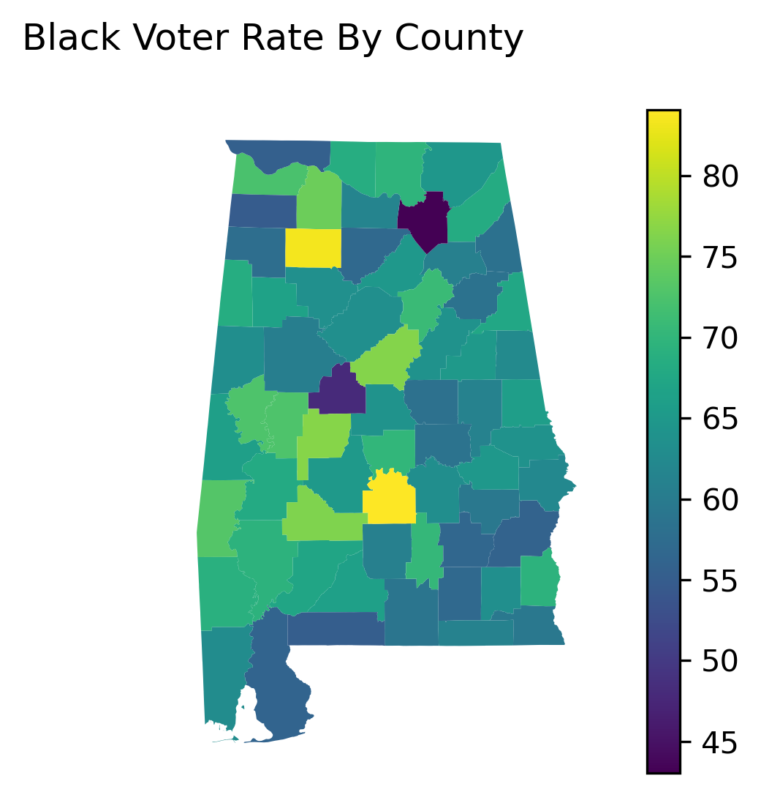
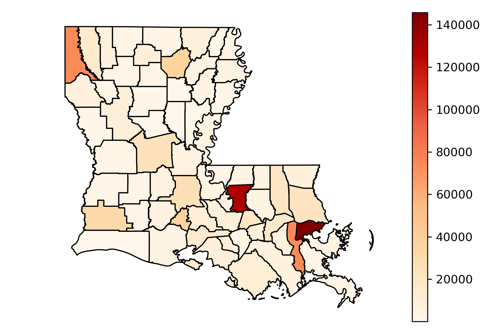
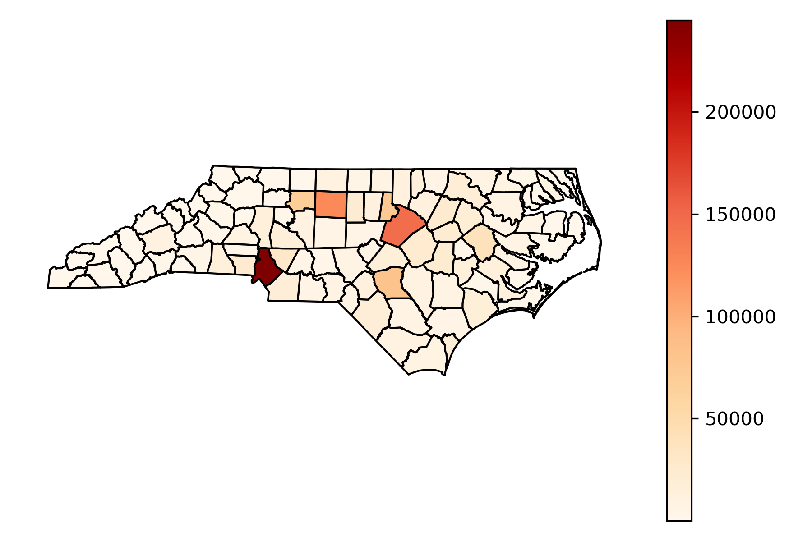

# The Effect of Lynchings on Black Voter Registration

Hi everyone! Rami here and this is my project. I've analyzed data to find the effect of lynchings on Black voter registration in a few Southern states. This project is based on research done by Dr. Jhacova Williams of the RAND Corporation.

## How My Analysis Differs:

My analysis differs in that I looked at the year 2020 and this year only for three states. Dr. Williams not only looked at more presidential voting years (2000, 2004, 2008, 2012, 2016) but she also included more variables in her analysis such as the education level of Black and white voters in each county, income and other variables which create a more holistic picture of each state. Dr. Williams also included county level voter turnout and other electoral variables into her analysis.

Overall, Dr. Williams finds that one additional lynching per 100,000 black
population in 1900, voter registration rates of blacks today decrease by 0.15 percentage points. My results only show a negative impact in Louisiana, not in Alabama or North Carolina.

Dr. Jhacova Williams is a doctor with a Ph.D. Please follow her work on this topic, not Rami the masters student.

## WHY LYNCHINGS?

I was inspired by my good friend Dr. Jhacova's research on this topic and I wanted to see if I could reproduce some of her results. She found that lynchings overall had an impact of 

## How to run the analysis:

1. Run Pop.py, this will allow you to choose a state to analyze. To do this, get the Southern state's FIPS code and their state abbreviation and input them into Pop.py. For example, here is the information for Louisiana below.

    Louisiana:  
    fips = "22"  
    po = "LA"

    Other states:

    Alabama:  
    fips = "01"  
    po = "AL"

    North Carolina:  
    fips = "37"  
    po = "NC"

2. This will get Python thinking about Louisiana and that delicious Pop.py data with all its herbs and spices! Now, go to Louisiana and check to see if all the information is properly inputed. The file you want to look at is Lynchings_LA.py. Each state file creates a heat map of Black voter registration across the state (the darker the area, the more registered Black voters) and a regression analysis that combines the Black voter registration per county/parish(Louisiana counties are called parishes) with the number of lynchings per county/parish. If it all works, you should get three figures for the state.

You can access voter registration data on the secretary of state's website for your chosen state. I've included the links for three states.

Alabama -

https://www.sos.alabama.gov/alabama-votes/voter/election-data

Louisiana - 
https://www.sos.la.gov/ElectionsAndVoting/Pages/RegistrationStatisticsStatewide.aspx

North Carolina - 

https://vt.ncsbe.gov/RegStat/Results/?date=05%2F07%2F2022
## Inputs and Outputs:

Inputs: FIPS Code, State Abbreviation, State Voter turnout data

Outputs: Heat Map of Black voter registration per state, scatter plot of the impact of lynchings on Black voter registration and a regression analysis of the impact of lynchings on Black voter registration.

## Other files

The Black.csv files for each state helped me separate the Black vote from other types of voters. Most of the other files in this reposistory are largely examples of outputs or they're secondary files that are used to help find each state's results. Your main focus should be the Python files that help you choose a state to examine and the python files for each state.

Heatmap files are test files for heatmaps, they work but you can ignore them.

## Limitations: 

This is a very small project compared to my friend's research. This project only looks at the 2020 voter registration data and for only 3 states. My friend's research came to much different and stronger conclusions, please refer to her research if you're interested in learning more. I have provided the link below. 

## Results:

 What I've found is that in certain states like Louisiana, Black voter registration is lower in counties that had more lynchings in their past. However, this trend wasn't found in Alabama or North Carolina.

This first regression above is for Alabama. As you can see, within counties a history of more lynchings is associated with higher Black voter registration.

Here you can see that in Louisana, more lynchings within a county/parish are correlated with lower Black voter registration.

North Carolina follows much of the same logic as Alabama.

Below are the counties with the highest Black voter registration:

The data is mixed. Louisiana confirms my suspicions but North Carolina and Alabama do not. I would like to be optimistic and say that this is another example of Black folks doing what they want inspite of oppression. However, to get a full picture I would need to test more presidential years and include other control variables. 